<p align="center">
  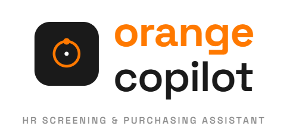
  &nbsp;&nbsp;&nbsp;
  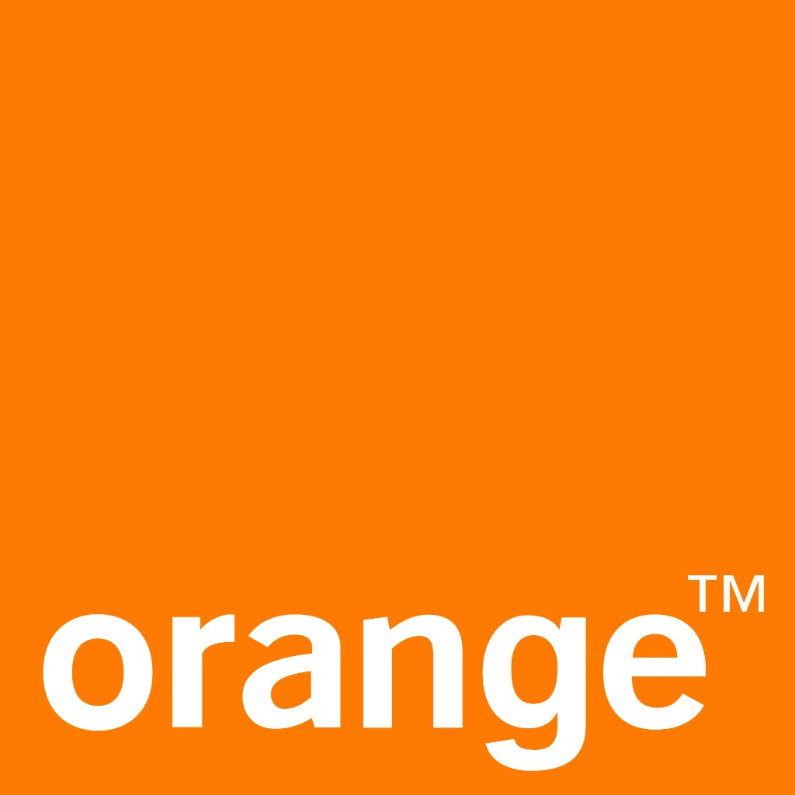
</p>

# Orange Copilot

**AI-assisted recruitment screening** for internal HR teams.

Publish a job, collect PDF resumes, score and rank candidates with a written justification, ask questions over stored CVs, then draft outreach that a human must approve before anything is sent.

Built as an internship / engineering deliverable for **Orange Tunisia**. React handles the HR interface. **n8n** owns the business logic. **PostgreSQL + pgvector** stores records and embeddings.


---

## Table of contents

- [What it does](#what-it-does)
- [Architecture](#architecture)
- [Tech stack](#tech-stack)
- [End-to-end flow](#end-to-end-flow)
- [Product screens](#product-screens)
- [n8n workflows](#n8n-workflows)
- [Data model](#data-model)
- [Repository layout](#repository-layout)
- [Local setup](#local-setup)
- [Design choices](#design-choices)

---

## What it does

| Area | Outcome |
| --- | --- |
| Job offers | HR publishes a role (title, department, description, skills). The offer is stored and embedded for later matching. |
| Applications | Candidates apply on a shareable HTML form (not the React app). They pick an open job and upload a PDF CV. |
| Scoring | Resume text is extracted, a match score (0–100) is generated with a justification, and the candidate is ranked. |
| Dashboard | Volume and quality at a glance: applications, open jobs, average score, strong profiles (≥ 70), awaiting analysis. |
| Chat RH | Free-text questions over resumes (RAG: embed → similar CVs → grounded answer). |
| Outreach | On-demand recommendation + editable email. SMTP send only after **Approve and send**. |
| Purchase assistant | Side module: describe a need, search the web, get compared product options. |

**Actors**

- **HR / recruiter** — React app (dashboard, offers, candidates, chat, purchase).
- **Candidate** — public apply form and confirmation page only.
- **Operator** — n8n, credentials, and the database (outside the product UI).

There is **no login** on the HR UI yet. Anyone who can open the app can use it. Plan accordingly.

---

## Architecture

```
Candidate (browser)          HR (browser)
        │                          │
        │  HTML form               │  React + Vite (port 5173)
        ▼                          ▼
              n8n webhooks (port 5678)
        apply · score · rank · chat · recommend · email · dashboard · jobs
                          │
          ┌───────────────┼───────────────┐
          ▼               ▼               ▼
     PostgreSQL      Groq (LLM)     Mistral (embeddings)
     + pgvector      SMTP           Tavily (purchase only)
```

The frontend is thin: it displays data and triggers webhooks. There is **no custom API server**. n8n is the backend.

| Layer | Role | Typical local port |
| --- | --- | --- |
| React (Vite) | HR SPA | `5173` |
| n8n | Workflows, AI calls, email, SQL | `5678` |
| PostgreSQL + pgvector | Jobs, candidates, scores, vectors | often `5434` in Docker |
| Candidate form | Public apply experience | `http://localhost:5678/webhook/candidate-form` |

---

## Tech stack

| Tool | Why it is here |
| --- | --- |
| React 18 + Vite + React Router | Fast SPA for dashboards and forms |
| n8n | Visible, editable pipelines instead of a custom backend |
| PostgreSQL + pgvector | Relational data and semantic search in one store |
| Docker | Repeatable Postgres + pgvector (especially on Windows) |
| Groq | Scoring, justifications, chat answers, recommendations, purchase analysis |
| Mistral embeddings | Vectors for jobs, CVs, and chat questions |
| Tavily | Live web search for the purchase assistant |
| SMTP (via n8n) | Candidate email after human approval |

---

## End-to-end flow

1. HR creates a job. Title + description + skills are saved and embedded.
2. HR copies the apply link from the Candidates page and shares it.
3. A candidate selects an offer and uploads a PDF.
4. n8n extracts resume text, inserts the candidate, embeds the CV, scores it against the job, stores the score, updates status.
5. The candidate sees a confirmation page.
6. HR reviews ranked profiles on the Candidates page and metrics on the Dashboard.
7. Optionally: Chat RH for questions like “who has AWS or Azure?”
8. Optionally: generate a recommendation, edit the email, **Approve and send**.
9. The candidate is marked contacted.

---

## Product screens

Screenshots below follow that loop: HR tools first, then the public apply path, then ranking and outreach, then chat and the purchase side-module.

### Dashboard

Realtime snapshot: applications received, active offers, average score, strong profiles, awaiting analysis.

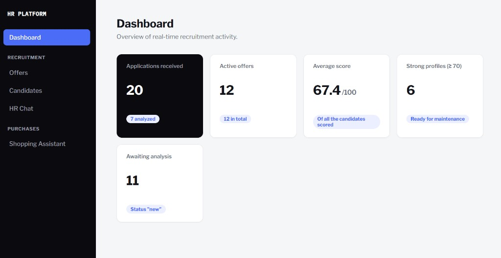

### Job offers

HR publishes a role. It is immediately available on the candidate form.

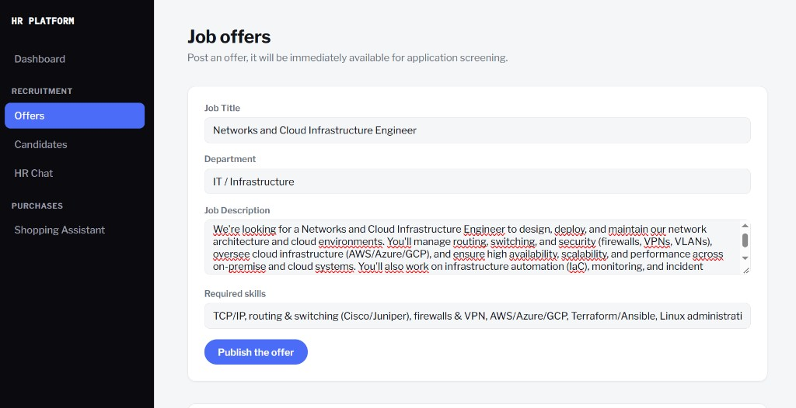

Published offers with skills as chips:

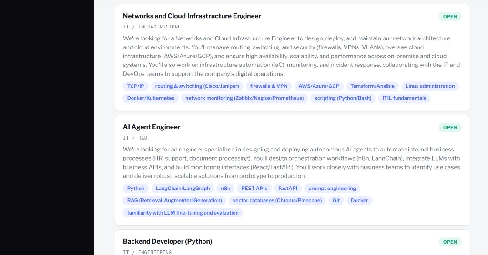

### Share the apply link

The Candidates page exposes the webhook form URL (copy for LinkedIn or email).

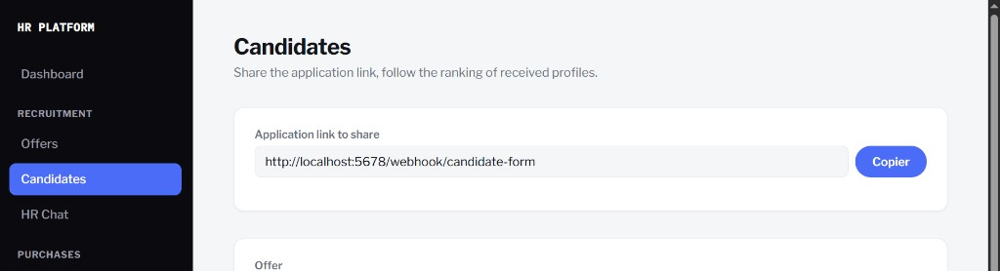

### Public application form

Served by n8n, not by React. Open jobs are loaded dynamically.

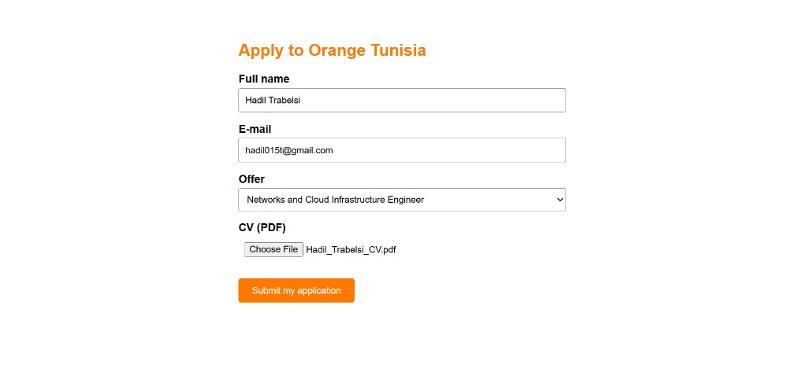

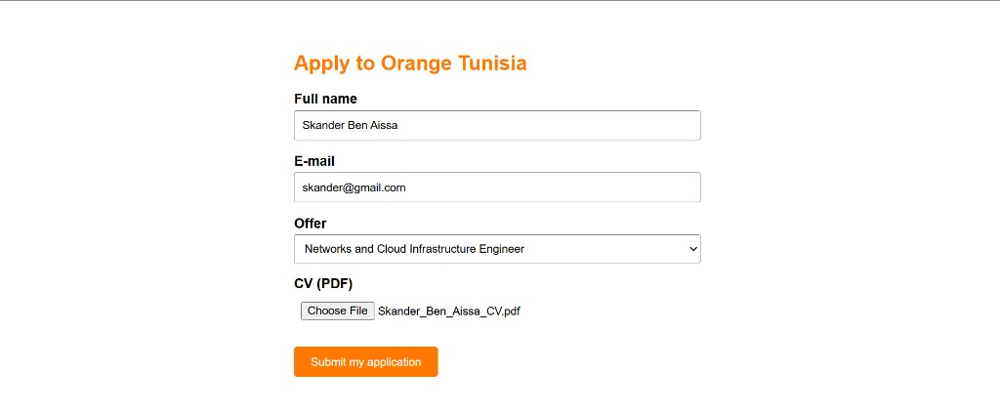

After submit:

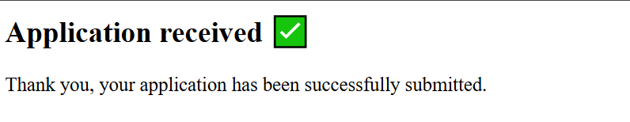

### Ranked candidates

Score out of 100 plus a written justification. Strong vs weak matches are easy to compare.

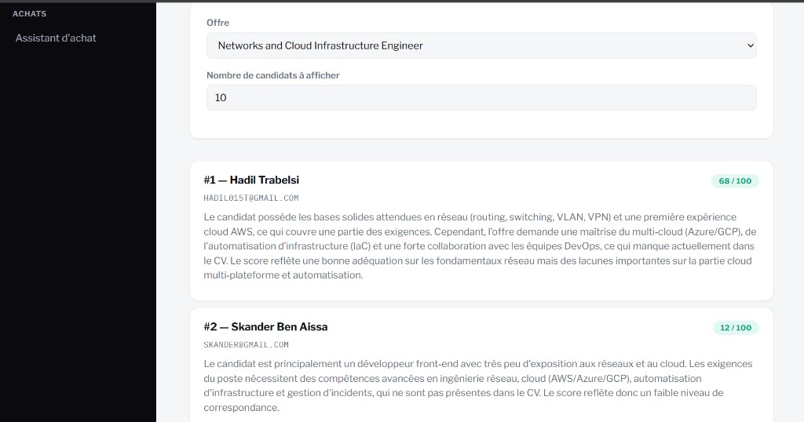

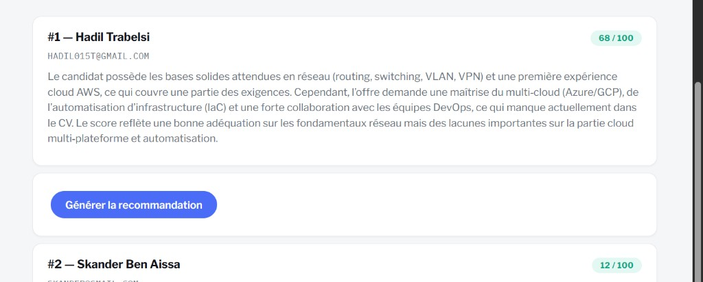

### Recommendation and supervised email

AI proposes a decision note and a draft. HR edits, then approves.

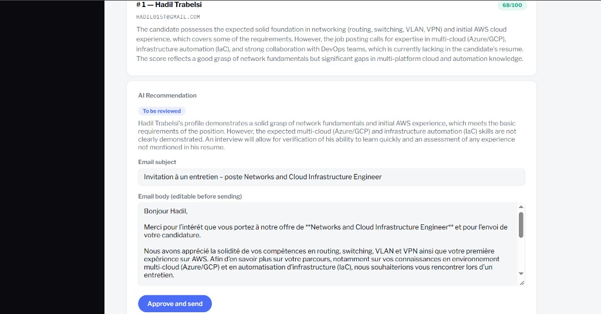

After send:

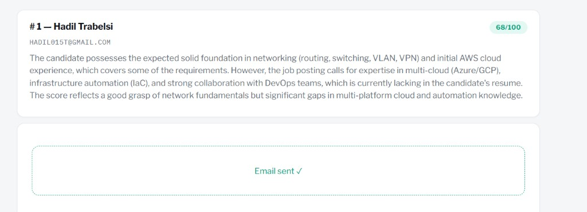

Contacted state on the list:

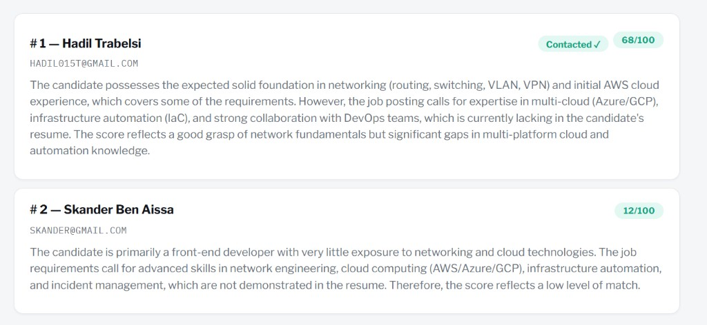

### Chat RH (RAG)

Ask a free-form question over stored resumes.

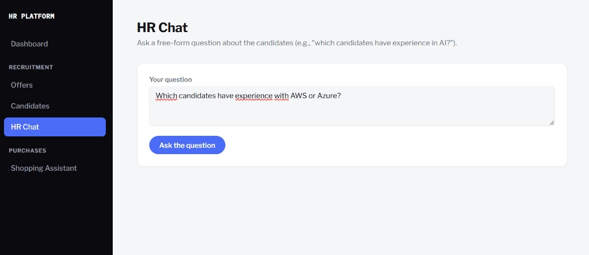

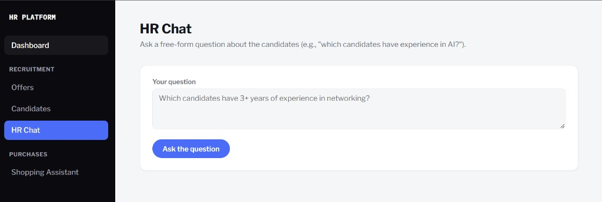

### Shopping assistant (adjacent module)

Describe a need (example: laptop, budget 1500 TND). The workflow searches the web and returns compared options.

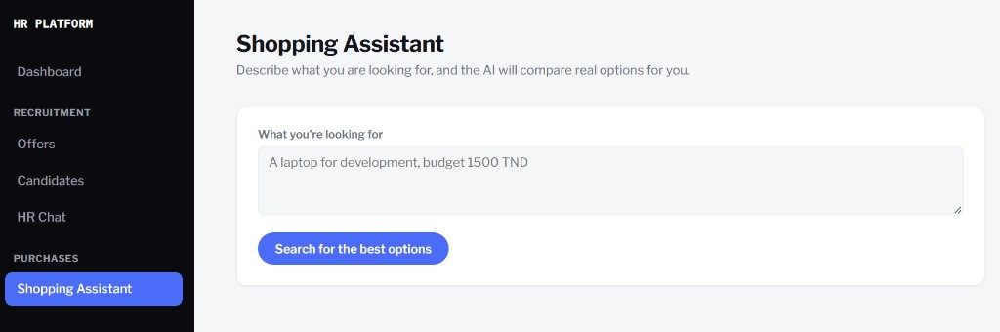

---

## n8n workflows

Each HR action maps to a webhook. Workflows are the source of truth for scoring, search, and email.

### 1. Serve the candidate form

`GET /webhook/candidate-form`

Load open jobs from Postgres → generate HTML → return the form.

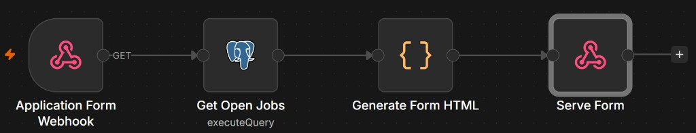

### 2. Create and list jobs

`POST /webhook/offer-create` — insert offer → Mistral embedding → update vector.

`GET /webhook/offer-list` — return stored jobs to the React Offers page.

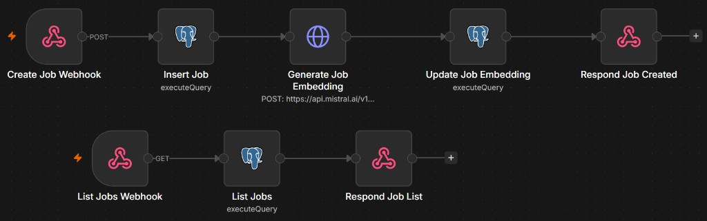

### 3. Ingest application, embed CV, score

`POST` receive-application webhook.

PDF extract → insert candidate → Mistral embedding → load job context → Groq scoring → insert match score → update status → confirmation HTML.

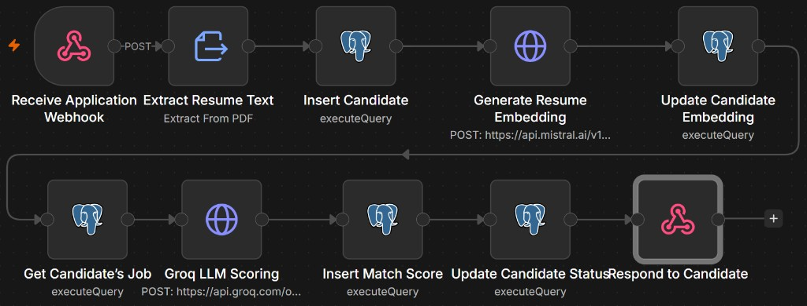

Variant with Groq scoring node labeled explicitly:

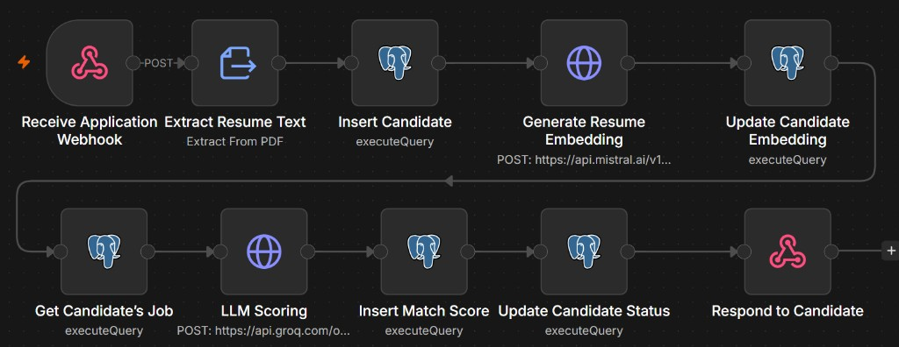

### 4. Dashboard stats

`GET /webhook/dashboard-stats`

Aggregate counts and averages for the home page.

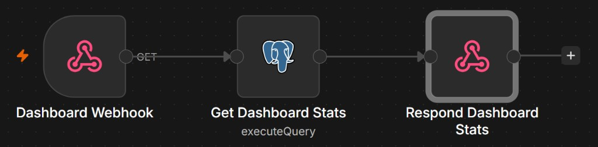

### 5. Top candidates

`GET /webhook/top-candidates?offer_id=…&top_n=…`

Ranked list for the Candidates page.

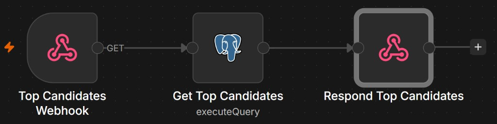

### 6. Generate recommendation

`POST /webhook/generate-recommendation`

Load candidate + job context → Groq draft (decision, note, email) → persist → return to UI.

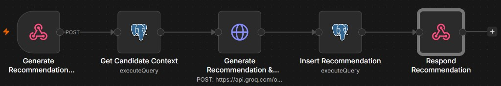

### 7. Send email (human-approved)

`POST /webhook/send-email`

Load candidate email → SMTP send → mark recommendation sent → update candidate status → confirm.

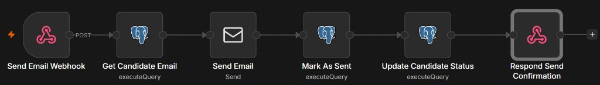

### 8. Chat RH (RAG)

`POST /webhook/ask`

Mistral embed of the question → pgvector similarity on resumes → Groq answer grounded in retrieved CVs.

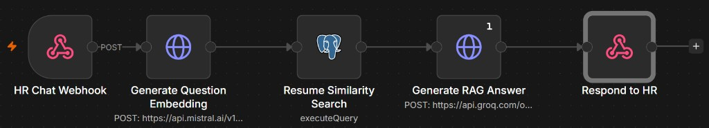

### 9. Purchase assistant

`POST /webhook/purchase-assistant`

Tavily web search → LLM structures ~3 options (name, price, pros/cons, source URL) → React cards.

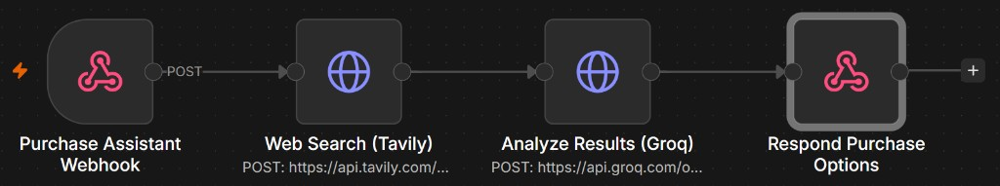

Alternate analysis node (gpt-oss on Groq):

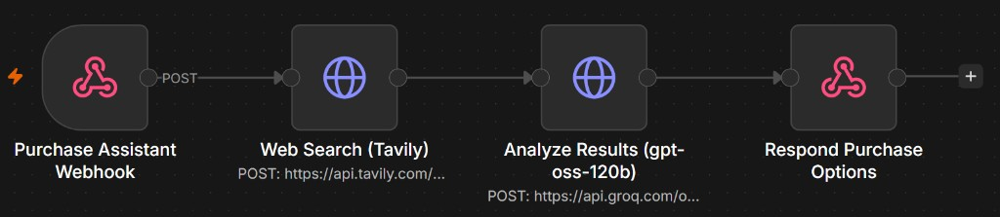

### Webhook map (frontend)

Defined in `src/api/n8n.js`:

| Action | Method | Path |
| --- | --- | --- |
| Create offer | POST | `/webhook/offer-create` |
| List offers | GET | `/webhook/offer-list` |
| Top candidates | GET | `/webhook/top-candidates` |
| Dashboard stats | GET | `/webhook/dashboard-stats` |
| Chat RH | POST | `/webhook/ask` |
| Generate recommendation | POST | `/webhook/generate-recommendation` |
| Send email | POST | `/webhook/send-email` |
| Purchase assistant | POST | `/webhook/purchase-assistant` |
| Candidate form | GET | `/webhook/candidate-form` |

Base URL in the UI: `http://localhost:5678/webhook`.

---

## Data model

Core tables (Postgres + pgvector, managed alongside n8n):

| Table | Purpose |
| --- | --- |
| `offers` | Job post, skills, status (`open` / `in_review` / `closed`), embedding |
| `candidates` | Applicant, resume text, optional file path, embedding, status (`new` → `scored` → …) |
| `match_scores` | Score 0–100 + justification, linked to one candidate and one offer |

Embeddings live next to business rows. HNSW indexes on `offers.embedding` and `candidates.embedding` support cosine similarity.

Recommendations (decision type, note, email subject/body, approval, sent-at) are stored by the recommendation / email workflows. Keep the live n8n schema aligned with these tables before a production handoff.

---

## Repository layout

```
.
├── src/
│   ├── api/n8n.js        Single n8n client
│   ├── pages/            Dashboard, Offers, Candidates, Chat RH, Purchase
│   └── components/       Layout, candidate detail
├── docs/                 App logos (icon + lockup) and screenshots
├── package.json
└── README.md
```

n8n workflow JSON and credentials live in the local n8n instance, not in this repo. Export them if you want versioned pipelines next to the UI.

---

## Local setup

**Prerequisites:** Node.js, Docker (Postgres + pgvector), n8n, API keys for Groq and Mistral (Tavily if you use purchase), SMTP for outreach.

1. Start PostgreSQL with the `vector` extension and create the offers / candidates / match_scores tables (with embeddings).
2. Start n8n. Configure Postgres, Groq, Mistral, SMTP (and Tavily) credentials. Activate the workflows above and keep webhook paths in sync with `n8n.js`.
3. Run the UI:

```bash
npm install
npm run dev
```

4. Open `http://localhost:5173` for HR. Share `http://localhost:5678/webhook/candidate-form` with candidates.

Secrets stay in n8n. Do not put API keys in the React app.

---

## Design choices

- **Human-in-the-loop send** — AI drafts; a person clicks send. Protects brand and candidate experience.
- **n8n instead of a custom API** — pipelines stay visible for demos and iteration.
- **One database for records and meaning** — no separate vector store.
- **On-demand recommendations** — expensive text is generated only when HR asks.
- **Dynamic apply form** — always reflects currently open jobs.
- **Split AI roles** — Groq for judgment and writing; Mistral for embeddings.


